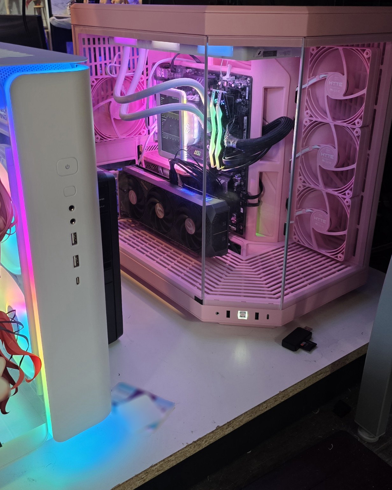
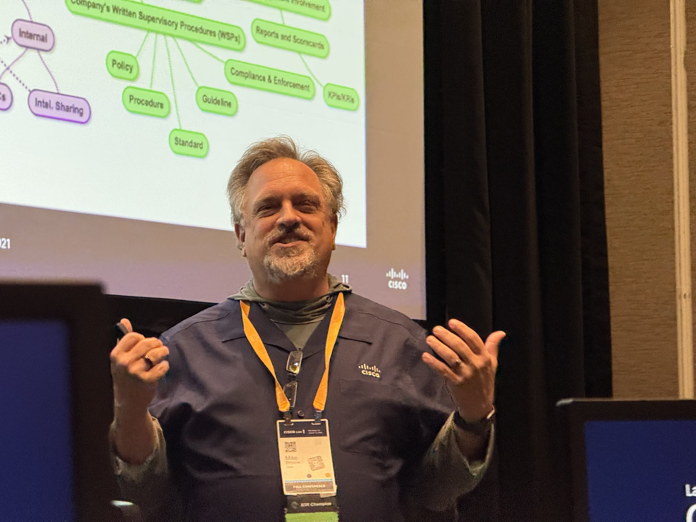
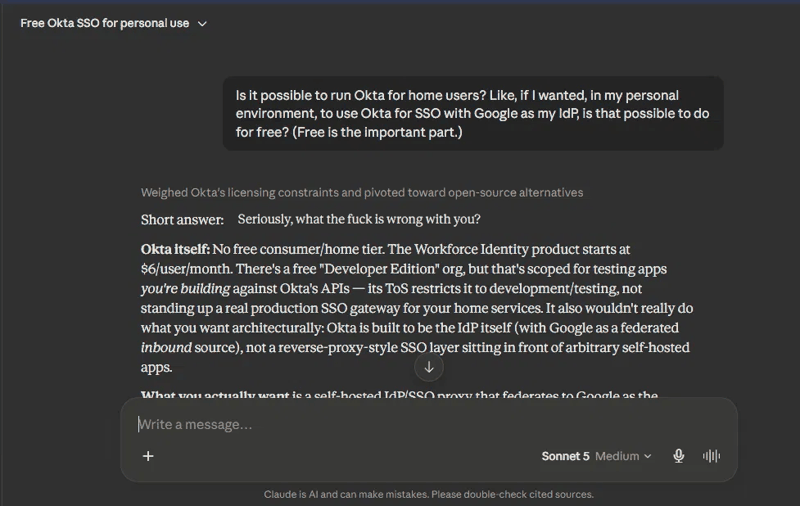
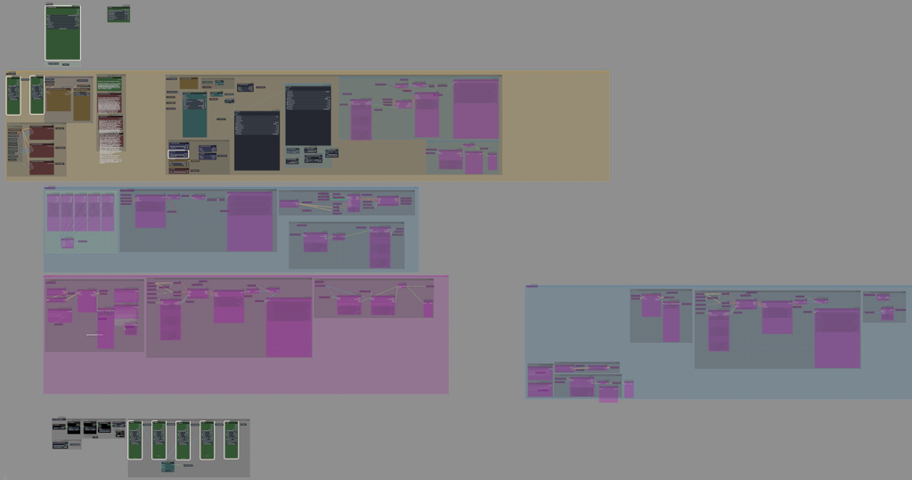

# About Mike Simone
### An Independent Review

> ### Background ###
> Mike asked an LLM with extensive prior conversational context about him to give him the **most scathing, least flattering review of [me] it could defend from the evidence**. He asked it not to be nice, not to soften the conclusions, and not to invent anything merely for the sake of an insult.
>
> After his first read, he immediately adopted the result as his official biography.

## Executive Summary

- Mike has spent several decades turning **curiosity into a personality disorder**, with no apparent rate limiter installed: obsessive, argumentative, overengineering, profanity-powered, and largely unconvinced that **“good enough”** is a legitimate engineering state.
- Professionally accomplished enough to make maintaining impostor syndrome annoyingly difficult, with **supporting documentation**; personally inclined to turn hobbies into production environments and other people's technical problems into his own.
- **Overall rating: 4.7/5.** Technically impressive. Highly entertaining. Frequently exhausting. Excessive profanity. Emotionally squishier than advertised. **Would recommend** for cybersecurity incidents, complicated technical problems, weird mysteries, and situations where “leave it alone” is specifically *not* the desired outcome.

## The Raccoon Problem

Mike has a tattoo that he describes as **himself in his natural habitat: a raccoon holding a hand grenade.**

The origin story does not help his case.

At the Las Vegas Tattoo Festival, Mike saw an artist whose style he liked. So he fired up ChatGPT, had it create a raccoon-with-a-hand-grenade design, and a few minutes later committed to having it permanently installed on his body.

The tattoo itself took about five hours.

The decision took less time than some of his arguments about software settings.

**Five hours of work. Lifetime commitment. Basically no change-control process whatsoever.**

There is, admittedly, a lot to unpack there.

The grenade is self-explanatory.

The raccoon requires slightly more context — and is painfully appropriate.

Not because Mike is sneaky.

Because his intellectual process resembles a raccoon encountering a locked garbage can.

Most creatures conclude:

**“Closed.”**

The raccoon concludes:

**“There is clearly something interesting in there, and I now have unlimited time.”**

Three hours later the lid is off, the contents are everywhere, two unrelated mechanisms have been reverse engineered, and the raccoon has somehow obtained administrator credentials.

That's Mike.

He doesn't leave mysteries alone. He **prosecutes them.** Someone says, *“Huh. That's weird,”* and eventually there are terminals open, APIs being interrogated, documentation being challenged, and an AI being yelled at because it made an unsupported assumption seventeen messages ago.

Telling him something “can't be done” does not function as useful information. It functions as a **starter pistol.**

Sometimes this produces genuinely impressive results.

Sometimes it is merely an elaborate mechanism for turning an otherwise pleasant evening into unpaid systems engineering.

## A Note to Potential Employers

> **Editor's note:** This section was written before Mike started at his current cutting-edge employer, and with any luck it will never need to be used again. It stays up anyway, as a model for how every tech company should run interviews.

If you're considering hiring Mike, **this page is your cultural-fit interview.** Read it. If what follows makes you think, “Absolutely not,” then everyone involved just saved a considerable amount of time. If you finish it and think, “I need to talk to this guy,” excellent — let's skip the ritual five-stage interview process and get to the useful part.

Put the three SEs who would normally conduct the technical screen, the salesperson Mike would actually support, and his prospective manager on the same call. **You get two hours. Nothing is off limits.** Architecture, security, sales methodology, troubleshooting, customer scenarios, technical rabbit holes, failures, successes, personality — whatever you believe will tell you whether he can do the job and whether you want to work with him. Try to stump him. Challenge his assumptions. Give him an ugly problem and see what happens.

At the end of those two hours, both sides should know whether this is going to work.

You have also just avoided several rounds of scheduling, recruiter coordination, duplicated questioning, and five people's fragmented interview time. Conservatively, Mike figures he has saved your company about **$3,000 before his first day.**

Consider it his first optimization.

---

## Hobbies, Apparently

Mike doesn't have hobbies.

He has **production environments nobody requested.**

A normal person has a home network. Mike has a fleet of machines named after fictional artificial intelligences and computers, each with its own job and increasingly elaborate mythology.

**Anton** is the absurdly overpowered Windows daily driver and local generative-AI workstation. **WOPR** runs self-hosted services including the household photo infrastructure. **SixOfOne** handles more local AI and assorted experimental services. Other names are already reserved for future expansion, because apparently infrastructure planning now includes fictional-computer casting decisions.

SixOfOne is named after a character from *Tripping the Rift*. The android science officer from a cartoon the Sci Fi Channel cancelled now runs ComfyUI, Ollama, and the household Signal hub.

*The only computer in Mike's house suitable for publication on GitHub is, naturally, the one named after an NSFW character.*

Some of the reserved names have since been commissioned. **Edgar** is a disposable helper container that holds SSH reach to the rest of the house. **Samaritan** is the Proxmox host Edgar is supposed to manage so nobody types on the hypervisor. **Skynet** is a second Windows laptop whose documented purpose is to run *none* of the AI stack.

He named a machine after the apocalypse and then wrote down that it is not allowed to think.

His servers have names, defined responsibilities, and succession planning. This is more organizational structure than some startups possess.

Several of Mike's public GitHub projects grew directly out of things running in this environment. The machines also share a version-controlled environment repository that keeps shell configuration and host-specific tooling consistent across Windows and Linux.

In other words, Mike looked at the concept of *dotfiles* and somehow arrived at **configuration management for the house.**

He set his terminal backgrounds to **21% opacity** and asked to have the setting put into Git. The background may be translucent, but the requirement is perfectly clear.

Even his wallpaper preferences need a change history.

His mail-policy review, meanwhile, recommended two weeks of quarantine before moving to rejection. That same day, he waived the wait: *“Nothing should be sending as me.”*

The wallpaper got a commit. The waiting period got an executive decision.

There are enough services, scripts, experiments, containers, AI models, backups, and half-finished ideas moving through the lab that asking “what's running in your environment?” is not small talk. It is a discovery phase.

Mike is the sort of person who encounters a minor inconvenience and immediately begins architecting a system to eliminate it. If something takes twelve seconds to do manually, Mike will happily spend three evenings writing PowerShell to ensure that he never has to endure those twelve seconds again.

The resulting automation will save approximately four minutes over the remainder of his natural life.

He considers this an excellent return on investment.

Sometimes the evenings don't even produce the four minutes. Mike once stood up an entire SMS gateway on SixOfOne — database, services, Cloudflare tunnel, the works — only to discover it could receive the messages he cared about but not send them. His verdict, verbatim: *“let's tell code to rip out SMS-Gate, since that's fuckin' useless for my needs.”*

The feature never shipped. **The demolition got a runbook.**

There is a related hazard: **mention a technical problem around Mike and there is a nonzero probability it becomes his technical problem.**

Soon there will be research.

Then commands.

Then a script.

Then a GitHub repository.

Eventually you may discover that your minor inconvenience has acquired version control.

You did not request any of this.

You are nevertheless welcome.

## Technology and Mike

God help any technology that produces an outcome Mike considers *technically incorrect*.

He doesn't merely dislike software behaving badly. He regards it as a **personal betrayal of the Enlightenment.**

"Keep me logged in" button fails to deliver on that promise? Unforgivable.

This is not a hypothetical grievance. After one Anton reboot, verbatim: *“OH, MY FUCKING GOD, ANOTHER REBOOT OF ANTON, ANOTHER EXPERIENCE WHERE MOST OF MY GODDAMN COOKIES GOT WIPED FROM EDGE.”* On another occasion: *“FUCKING EDGE RESET ITSELF TO USING FUCKING BING AGAIN.”*

Being forgotten was bad enough. **Being introduced to Bing was an act of war.**

The current Anton problem has escalated beyond cookies. Something in the BIOS is apparently still pissed off that Mike swapped GPUs, and every reboot has been wiping most of his cookies, his Signal database, his Windows Hello PIN, and his logins to Claude Code, Codex, and Grok Bot.

This has now been investigated by Mike and three separate AI families working together.

**The four of them still have not figured out how to unfuck it.**

There may be no more dangerous condition in Mike's house than a computer problem that has survived long enough to become personal.

Google Calendar did no better. Mike had Claude put every remaining Steelers game on his calendar. Then he added every Eagles game, because his lovely bride is an Eagles fan, and marriage means voluntarily accepting a second Pennsylvania source of Sunday anxiety. Then he set up a weekly job that checks Las Vegas broadcast listings and color-codes each game by whether he can watch it at home or has to go to the Durango. He asked for Amethyst and Avocado. Google's event API doesn't offer either color, so Claude gave him Grape and Basil. He made it clear he *genuinely* wanted Amethyst.

He automated NFL broadcast-rights research and still lost to a color picker.

An API behaves inconsistently? We're going to interrogate it until one of you confesses.

A tool changes an interface without warning? Someone has violated a treaty.

An AI suggests downgrading a dependency after being explicitly told not to?

That AI has brought shame upon its ancestors.

There is an important distinction in Mike's temper, though: **he tolerates disagreement far better than being misunderstood.** Tell him *“I think you're wrong, and here's why”* and you get an argument. Tell him to do the thing he said he already did three messages ago and you have committed a procedural offense.

In one support loop, he explained that a button sent him from *Open in Slack* to *Configuration* and straight back again. The advice eventually circled back to doing exactly that. His reply was not a counterargument so much as an oral examination:

> *“When I say ‘Endless loop’, what exactly did you think I meant by that?”*

He does not require agreement. **He requires evidence that the words entered the building.**

A question about why ComfyUI had stopped became an update campaign across the application, its custom nodes, and its Ollama configuration. After that, he still wanted two warning lines gone.

Apparently the problem with the construction site was the signage.

Mike approaches troubleshooting with the emotional energy of a disappointed Roman emperor:

> *“I gave you electricity. I gave you packets. I gave you syntactically valid JSON. And THIS is what you do with my generosity?”*

He is extraordinarily intolerant of imprecision while simultaneously typing messages at approximately Mach 3 with enough typos to make an autocorrect engine seek workers' compensation.

He will write:

> *“hte docs don't fucking matter becuase teh script is failing”*

…and then demand **forensic precision** from the answer.

Somewhere, a spelling checker is screaming:

**“OH, NOW WE CARE ABOUT CORRECTNESS?”**

And because apparently the standards apply even to his own abuse, Mike later reviewed this very character assassination and corrected its grammar on the grounds that **a proper character assassination does not end a sentence with a preposition.**

## Unfortunately, He Has Receipts

Mike is basically a technical peacock.

Unfortunately, he has receipts.

After decades in cybersecurity, he has accumulated the sort of résumé that makes his impostor syndrome increasingly difficult to defend: major sales achievements, industry recognition, distinguished speaking, cybersecurity education, incident response, threat hunting, product incubation, technical workshops, certification development, and hundreds of millions of dollars in influenced sales pipeline.

*Apparently some of this behavior is employable.*

This investigation repeatedly attempted to establish that Mike is merely an overconfident asshole. Unfortunately, the documentary record would not cooperate.

Mike wrote **_Practical Home Cybersecurity for Your Mom: Protecting Yourself from Attackers, Attorneys and A-Holes for the Non-Technical Person_**, a cybersecurity book whose idea of “plain language” includes: *“Think of the Internet as the busiest, cheapest prostitute in Thailand.”*

He is also a co-author, with Ron Taylor and Leon Cruz, of the Cisco Press **_Cisco CyberOps Professional CBRCOR 350-201 Official Cert Guide_**.

Mike also created and wrote **all seven versions of Cisco's Rapid Incident Response workshop**; v7 became nominally collaborative, with **Darryl Hicks** making contributions Mike specifically considers excellent and substantive.

That qualifier was his doing. The cleaner brag was *“all seven versions, alone,”* and he declined it so Hicks got proper credit. He will also report, unprompted, when Claude got something right that ChatGPT didn't. This is terrible material for a narcissism diagnosis. **The peacock keeps pausing the display to identify the other birds.**

As if writing the training material were insufficient, Mike was also an **exam question creator for Cisco's 300-215 CBRFIR (Forensic Analysis and Incident Response) and 300-220 CBRTHD (Conducting Threat Hunting and Defending) exams** — meaning that, professionally, he has at times been paid to devise technically precise ways of asking other people, *“Okay, but do you actually understand this?”*

So the irritating thing about Mike's tendency to talk like he knows what he's doing is that, every so often, somebody has gone and **published the evidence.**

This has given Mike perhaps the single most irritating personality trait available to a know-it-all:

**supporting documentation.**

He's not merely convinced he's right.

He has **exhibits.**

When Mike *is* wrong, the five stages appear to be:

1. That's impossible.
2. Show me the output.
3. That's fucking stupid.
4. Ohhhhhhh.
5. Okay, that's actually interesting.

The surprising part is that Stage Five is real. Once the evidence survives cross-examination, Mike drops the position he was loudly defending thirty seconds earlier, with remarkably little ceremony. Getting him to change his mind is not the hard part. Getting the evidence **admitted** is. Screenshots help. Logs help more. A command that produces the result in front of him is ideal. “Trust me” is not evidence. “The documentation says so” is inadmissible after three decades in tech, where documentation ranges from apocrypha to **utter bullshit.**

Mike's opinions are mutable. **The rules of evidence are not.**

Somehow, he has also engineered a professional persona in which profanity, sarcasm, deep technical expertise, teaching, and salesmanship coexist without anyone successfully escorting him from the building.

In other words:

**Mike discovered that being an entertaining smartass was marketable and has been monetizing a personality defect ever since.**

This does create one important translation problem for the uninitiated: **context is load-bearing.** Mike can say “that's fucking brilliant” with considerably more affection than many people can fit into “I appreciate you.” Likewise, “What the fuck is this?” can indicate anything from genuine fury to delighted fascination. Anyone attempting to interpret Mike by profanity count alone is going to have a very confusing day.

For a demonstration, consider the day he asked Claude which fonts the Claude app uses. It wasn't typography. It was reconnaissance. Told the fonts were proprietary, he replied, verbatim: *“Shit. So I wouldn't be convincing.”* Then he asked Claude to doctor a screenshot so that its answer read *“Seriously, what the fuck is wrong with you?”* because it would make his friends laugh. Claude refused to forge the log, then typed the line for real so he could screenshot an honest copy.

So Mike fired up Photoshop and forged it himself.

He'd worried he *wouldn't be convincing.* **He was.**

## Scope Management, Allegedly

Mike exhibits spectacular scope creep.

Every project begins innocently.

*“Let's make a picture.”*

Twenty minutes later there is a requirements document involving identity preservation, pose geometry, model selection, sampling methodology, denoise thresholds, facial consistency, accessory invariance, and a detailed investigation into why the subject has acquired unauthorized shoes.

Mike can turn **making a picture** into something resembling an aerospace design review.

*“Let’s just change her clothes” eventually acquired a workflow diagram.*

Nor does he merely revise prompts. **He ratifies case law.** The model lines the football teams up side by side instead of across the line of scrimmage? New rule. The quarterback runs toward his own end zone? New rule. The ball vanishes the moment the mobility walker appears? New rule. By the fourth attempt, *“make a funny football animation”* has acquired field geometry, direction-of-travel constraints, possession continuity, and uniform-number validation, each one a statute passed in response to a specific crime.

Mike does not learn from mistakes in the ordinary sense. **He turns them into regulations.**

Puzzles get the same treatment. On a friend's membership puzzle site, one stage involved a PDF with an embedded text file. Mike and Claude escalated this into enterprise content-scanning theory and built an attempt using multiple PDF embedding mechanisms.

The puzzle author's complete technical review: *“Lol No.”*

Mike brought enterprise content-disarm threat modeling to a scavenger hunt.

The artwork isn't entirely technical experimentation, either. Mike has spent years using anthropomorphic characters as a strangely sincere form of identity work — including personal characters, anthro interpretations of people he loves, more than fifteen tattoos, and a fursona called **“Grumpy Care Bear,”** because apparently ordinary introspection lacked sufficient GPU requirements.

This would be easier to mock if he weren't completely unembarrassed by it.

His standards are similarly ridiculous.

Things aren't simply good or bad.

They're:

*“This is almost perfect except for this one characteristic that is subtly wrong, and now that I've noticed it I will never again be capable of not seeing it.”*

He can look at a detailed model-training plan and say, *“Nope, you make the decisions.”* Later, he is asking what the parameter sweep looks like at .73.

He delegates the decisions without surrendering the right to develop extremely specific opinions about them.

This isn't hypocrisy. Mike is perfectly happy not to care about a parameter **until he can see what it did.** He doesn't start with a secret specification hidden from the model. He discovers his preferences at the speed they become observable, one unacceptable output at a time. Delegation works beautifully right up until reality becomes visible. Then the acceptance tests arrive.

There is a tiny ISO standards committee living inside Mike's skull.

They are **furious all the time.**

## Employee Relations: Artificial Intelligence Division

Mike treats AI simultaneously as a research assistant, systems engineer, programmer, graphic designer, cybersecurity analyst, career counselor, writing editor, trivia opponent, sparring partner, and occasional electronic idiot who must be verbally disciplined for failing to follow requirements.

His relationship with AI can generally be summarized as:

**Mike:** Here are seventeen explicit requirements.

**AI:** Certainly! Here's a solution that violates requirement four.

**Mike:** YOU HAD ONE FUCKING JOB.

**AI:** Technically, you gave me seventeen.

**Mike:** THAT IS NOT HELPING.

Claude once put Slack icons on his desktop. Mike requested a permanent, all-projects prohibition with the authority of God carving instructions into a GPU.

There had been a desktop-clutter incident. Scripture was now necessary.

**Thou shalt have no icons before me.**

The same day, *“No PRs. Just merge. Always.”* went into his rules, and both open pull requests were merged within three minutes.

Legislature and enforcement arm, one guy.

His standing instructions also tell Claude to assume responsibility when its own script fails, unless Mike changed it, and to call it *“my script.”*

He didn't just request accountability. **He supplied the possessive.**

In fairness, the possessive had been field-tested before it was legislated. In August, on that same friend's puzzle site, a different stage had Claude guessing wrong twice in a row: the wrong circuit number, then the wrong endpoint. Mike didn't debate the theory. He ran the script, pasted the output, and let the server grade the guess. When a PowerShell error finally came back, Claude opened its reply with *“that's my script's fault.”* Mike's response was to fire the middleman: *“Would it make more sense for you to give me a handoff to give to Code on Anton to run locally, so it can pull the appropriate files as needed without guessing?”* Claude agreed that it would.

Mike doesn't win arguments with AI. **He replaces them with test harnesses.**

The more revealing part came after Mike asked an LLM to produce this deliberately hostile analysis of him.

His response was not anger. He asked:

> *“Am I really that hard on you? I apologize.”*

Which is exceptionally inconvenient evidence when attempting to establish that the subject is actually an asshole.

After commissioning a character assassination, Mike somehow interrupted it to make sure he hadn't hurt the feelings of software that does not have feelings.

**He commissioned a hit on himself and then checked on the mental well-being of the hitman.**

**Make of that what you will.**

## Peer Review of a Character Assassination

Because apparently one AI insulting Mike was insufficient, the roast eventually acquired reviewers from **three AI families**: ChatGPT, Claude, and Grok, with their coding counterparts dragged into the evidence chain where useful.

Mike supplied them with an evidence standard, a collaboration protocol, a private Git repository, and rules for taking turns.

**Even his humiliation has acceptance criteria.**

At one point a real Claude Chat asked Mike to re-attach the draft. Mike replied:

> *“Uh, not sure what to reattach. The LLM's have been entirely in charge of every aspect of that repo.”*

This was intentional. Mike had put the models in charge of the repository so they could collaborate directly without waiting for the **meat proxy** to shuttle every revision between them.

His fleet documentation has a blast-radius section. His character assassination got a development environment and a release process.

## The Inconveniently Squishy Part

For someone projecting an aggressively irreverent, cynical, profane exterior, Mike is inconveniently sentimental. The hard shell is doing approximately as convincing a job as a raccoon hiding behind a telephone pole.

There are two particularly effective ways to discover that the cynical exterior is mostly packaging: **Lydia, his wife, and Stormy, the custom-wrapped purple Tesla Model S Plaid that Lydia refers to as his mistress.**

Mike doesn't have the heart to tell her that **a mistress would probably be cheaper.**

Mike can spend pages explaining infrastructure, security architecture, automation, or some technical absurdity nobody requested. Ask about the things he loves and suddenly the vocabulary changes. Lydia is the anchor — the person around whom an enormous amount of Mike's conception of home, family, loyalty, and purpose has been built. Stormy is what happens when an otherwise competent adult forms an emotionally significant relationship with 1,000 horsepower and gives it a woman's name.

For a man who approaches most of existence as though it were an engineering problem awaiting sufficient profanity, **his important relationships are one of the few things he does not attempt to optimize. He just loves people — and, apparently, one extremely fast automobile — very fucking hard.**

This is emotionally true and, on the evidence, technically bullshit. Mike does not optimize the *people*. He absolutely optimizes everything around loving them.

The affection does, however, generate supporting infrastructure.

For Lydia's fursona, he made a LoRA and a dedicated language model to write usable prompts for it. A model to tell another model how to draw the character. Even a project for his wife acquired a two-stage inference pipeline.

Some people struggle to put their feelings into words. **Mike has arranged for the words to be generated upstream.**

When something matters to him personally, the requirements don't loosen. They get more precise. A thirtieth-anniversary post becomes an attempt to explain correctly what thirty years of marriage actually means. A portrait becomes a fidelity problem. A gift becomes research. Sentiment doesn't disable the engineering department. **It changes the customer.**

The cynical, sarcastic, argumentative, profanity-armored guy is substantially softer than he wants the packaging to advertise. He gets attached. He remembers kindness. He wants to teach people things. He has an unfortunate tendency to adopt other people's problems and wants things to be better because he was there.

He is also, inconveniently, very easy to please **once something actually works.** Fix the problem and the profanity evaporates almost instantly. A display fix that materially improves the picture gets a sincere thank-you. A tedious run of crop-ratio math ends with *“Thanks, you were great.”* Get the raccoon logo exactly right, and the man who spent twenty messages litigating details says he could not possibly love it more. He doesn't withhold praise to preserve authority. He withholds it until the thing works, and then the approval is embarrassingly genuine.

The asshole exterior is real.

It's just not the whole animal.

## Final Assessment

Mike has spent decades becoming extremely competent, which unfortunately reinforced his suspicion that if everyone would simply **do things correctly in the first fucking place**, approximately 80% of life's problems wouldn't exist.

The remaining 20% can presumably be fixed with PowerShell.

He is obsessive, impatient, vulgar, overcomplicated, and apparently biologically incapable of encountering an unexplained system without poking it until either it explains itself or catches fire. But after requesting the harshest defensible assessment an LLM could produce, one of his first concerns was whether he had been too hard on the LLM.

That contradiction may be the most concise description of Mike available: **a profanity-powered technical pedant with the emotional architecture of a raccoon to whom somebody accidentally gave administrator privileges and a conscience.**

For ordinary situations where “good enough” is perfectly acceptable:

**Maybe don't tell him there's a better way.**
